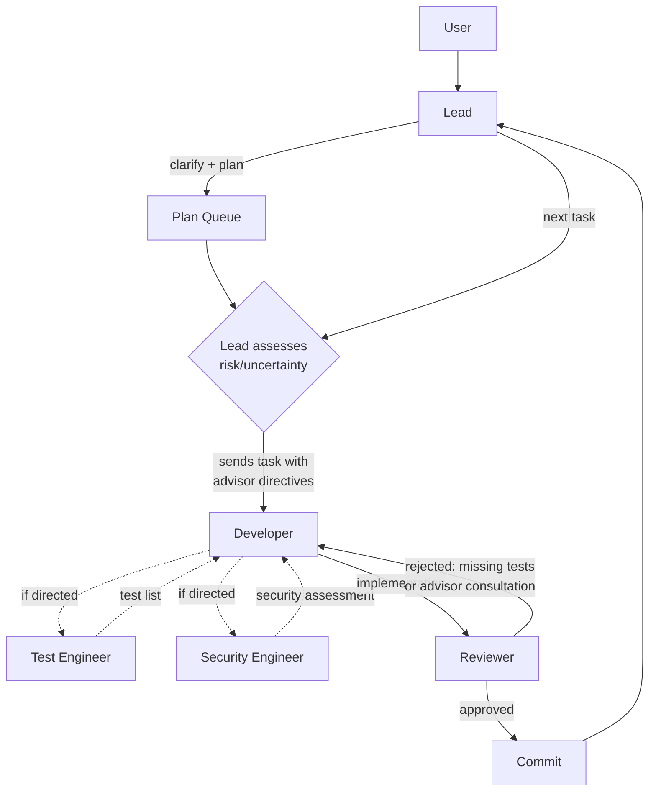
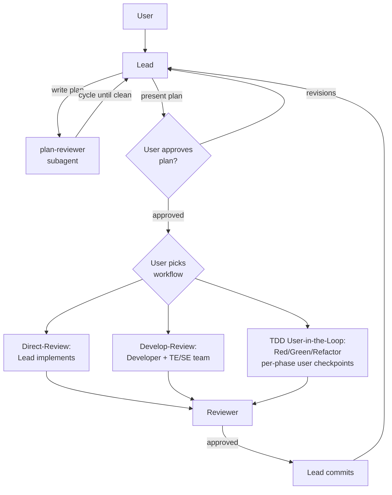

# Claude Orchestration Kit

A toolkit for building Claude Code multi-agent setups.
This repository provides design rules, audit skills, a
test harness, and conventions for creating `.claude/`
configurations — called **blueprints** — that turn a Claude
Code session into a coordinated multi-agent team. Two
production-ready blueprints are included.

## How It Works

The project has two layers:

```text
/.claude/                          ← The toolkit (this repo's tooling)
│   rules/                         ← Design rules for blueprint development
│   skills/                        ← Audit skills (/blueprint-audit, /cache-audit)
│
blueprints/*/                      ← Products of the toolkit
│   .claude/                       ← What gets copied into target projects
│       CLAUDE.md, agents/, rules/, skills/, workflows/
│
devcontainer_templates/            ← Docker sandboxes for agent execution
```

**Toolkit** (`/.claude/`) — rules, skills, and conventions
used when building or extending blueprints. Never copied
into target projects.

**Blueprints** (`blueprints/*/.claude/`) — complete agent
setups: lead instructions, agent definitions, rules, skills,
and workflows. Copy one into your project, start Claude Code,
and your session becomes the team lead.

## The Toolkit

The toolkit encodes what makes a blueprint work well —
agent design principles, prompt caching constraints,
terminology standards, and structural tests. It is what
you use when creating a new blueprint or extending an
existing one.

### Design Rules

Rules in `/.claude/rules/` guide blueprint development:

| Rule | Purpose |
|------|---------|
| `agent-design.md` | Agents define role only — no named teammates, no workflow coupling |
| `reasoned-instructions.md` | Include rationale when it changes how an agent applies an instruction |
| `prompt-caching.md` | All static content must respect the cache prefix order |
| `terminology.md` | Official terms: launch subagents, create teams, spawn teammates |
| `handoff-coverage.md` | Every pipeline guarantee needs an owner with sufficient input |
| `simplicity.md` | KISS, YAGNI, fewest elements |
| `behavior-preserving-cuts.md` | Only cut prose that doesn't change agent behavior |
| `self-check.md` | Post-change verification checklist |
| `hooks-guide.md` | When and how to use Claude Code hooks |

Plus language-specific rules (Python, Go, Rust, TypeScript)
and code quality rules (`code-principles.md`,
`functional-style.md`, `documentation.md`).

### Audit Skills

- **`/blueprint-audit`** — audits a blueprint for
  cross-file consistency, stale references, contradictions,
  rationale completeness, and documentation alignment
- **`/cache-audit`** — checks setup against prompt caching
  best practices (ordering, tool stability, dynamic content)

### Test Harness

Every blueprint has a test suite (`blueprints/*/tests/`)
using pytest with `-m static` markers. Tests verify file
structure, agent frontmatter, caching compliance, settings,
and rule file length. `blueprint_contracts.py` is the
single source of truth for each blueprint's expected
structure.

```bash
which uv || curl -LsSf https://astral.sh/uv/install.sh | sh
uv run pytest blueprints/workflow/tests/ -m static -v
uv run pytest blueprints/autonomous/tests/ -m static -v
```

### Extending Blueprints

See [CONTRIBUTING.md](CONTRIBUTING.md) for step-by-step
recipes: adding languages, workflows, agents, skills,
sanity checks, and language-specific init procedures.

## Included Blueprints

| Blueprint | Approach | Agents |
|-----------|----------|--------|
| **autonomous** | Full autonomy after plan approval via a plan queue | Lead, Developer, Reviewer, Test Engineer, Security Engineer |
| **workflow** | User chooses a workflow after plan approval | Lead, Developer, Test Engineer, Security Engineer, Reviewer |
| **exact-coding-autonomous** | Strict red-green-refactor TDD for automated evaluation runs | Lead, Refactor (subagent) |

### When to Use Which

| If you want... | Use |
|---|---|
| Maximum throughput, minimal interaction | autonomous |
| Full autonomy after plan approval | autonomous |
| Plan queue with concurrent clarification | autonomous |
| Lead stays responsive during execution | autonomous |
| Multiple workflow options (supervised, autonomous, TDD) | workflow |
| Per-commit user approval | workflow (Supervised) |
| Strict TDD with measured prediction blocks | exact-coding-autonomous |
| Headless evaluation framework run (no user in loop) | exact-coding-autonomous |

### Quick Start

```bash
# Copy a blueprint into your project
cp -r blueprints/autonomous/.claude/ /path/to/your/project/.claude/
# or
cp -r blueprints/workflow/.claude/ /path/to/your/project/.claude/
# or
cp -r blueprints/exact-coding-autonomous/.claude/ /path/to/your/project/.claude/
```

Start Claude Code in your project directory. The CLAUDE.md
loads automatically and configures your session as the team
lead.

Agent teams are an experimental Claude Code feature,
disabled by default. Each blueprint's `settings.json`
enables them automatically. You can also set the environment
variable directly:

```bash
export CLAUDE_CODE_EXPERIMENTAL_AGENT_TEAMS=1
```

### autonomous — Plan Queue + Developer

The lead handles clarification, planning, and plan queue
management. For each task, the lead assesses risk and
uncertainty at dispatch time and directs the Developer to
consult advisors when warranted. The lead stays responsive
to the user during execution — new requests become plans in
the queue.

**Agents:**

| Agent | Model | Role |
|-------|-------|------|
| Lead | Opus | Clarifies task, writes plans, manages plan queue |
| Developer | Sonnet | Implements all code (source + tests) |
| Reviewer | Opus | Quality gate — scope verification, code review |
| Test Engineer | Sonnet | Advisory — test lists on demand |
| Security Engineer | Sonnet | Advisory — security assessments on demand |
| Plan Reviewer (subagent) | Sonnet | Reviews draft plans before user presentation |



The Reviewer provides a backstop: non-trivial behavioral
changes without tests or advisor consultation are rejected.
The Developer-Reviewer rejection loop is opaque to the lead.

### workflow — Clarify-First

The lead clarifies the task, writes a plan (reviewed by the
plan-reviewer subagent and approved by the user), then
presents workflow options. The user chooses how work gets
done. Workflows are separate files in `.claude/workflows/` —
adding one requires no changes to CLAUDE.md.

**Agents:**

| Agent | Model | Role |
|-------|-------|------|
| Lead | Opus | Clarifies task, writes plan, presents workflow options, coordinates |
| Developer | Sonnet | Implements all code (source + tests) |
| Test Engineer | Sonnet | Advisory — designs test specs, verifies coverage |
| Security Engineer | Sonnet | Advisory — checks security gaps |
| Reviewer | Opus | Quality gate — reviews and proposes commit message; lead commits |
| Plan Reviewer (subagent) | Sonnet | Reviews draft plans before user presentation |
| Test List (subagent) | Sonnet | Converts an example mapping into a minimum required test list (used by `/test-list`) |

**Workflows:**

- **Direct-Review** — lead implements the approved plan
  directly, Reviewer checks quality. For well-scoped tasks.
- **Develop-Review (Supervised)** — full dev cycle with
  test-list-driven development and user approval per
  commit.
- **Develop-Review (Autonomous)** — same as Supervised but
  the lead commits automatically after Reviewer approval,
  with no per-commit user checkpoint.
- **TDD User-in-the-Loop** — strict Red-Green-Refactor with
  user approval at every phase transition.



Planning is shared across all workflow variants — the
plan-reviewer cycle and user plan approval happen *before*
workflow selection, so workflow choice is orthogonal to
plan content. Per-commit user approval applies to
Direct-Review, Develop-Review (Supervised), and TDD;
Develop-Review (Autonomous) commits as soon as the
Reviewer approves.

**Skills:**

- **`/project-init`** — scans the project, generates
  `CLAUDE.md` context (overview, build commands,
  conventions, references). Run on first session.
- **`/project-sanity`** — audits the repository for
  common issues across detected technologies
  (report-only).
- **`/example-mapping`** — facilitates an interactive
  Example Mapping session and writes a structured
  mapping file. Use as the upstream input for
  `/test-list`, or as clarification context for any
  workflow.
- **`/test-list`** — TDD entry path; converts an example
  mapping into a minimum-required test list embedded in
  the plan. Filters subsequent workflow selection to the
  TDD variants.

Language-specific guidance loads automatically via
conditional rules when agents touch matching files.

### exact-coding-autonomous — Strict TDD for Evaluation

Drives the red-green-refactor cycle as a measured sequence
of Skill and Task calls. Intended for headless evaluation
frameworks: no user interaction, no plan approval, no
clarification gates — the feature spec arrives in the
initial prompt and the session runs the loop until all
tests pass, then writes a `experiment-done.txt` marker.

**Agents:**

| Agent | Model | Role |
|-------|-------|------|
| Lead | (any) | Invokes skills, launches refactor subagent, runs the loop |
| Refactor (subagent) | (any) | Refactoring pass after each green — isolated context, applies APP and naming evaluation |

**Skills:**

- **`/test-list`** — writes the initial `it.todo()` list
  scoped to base functionality of the feature
- **`/red`** — activates exactly one `it.todo()`, records
  compile- and runtime-error predictions, verifies failure
- **`/green`** — writes the minimal implementation to turn
  the active test green

The Skill and Task tool calls per cycle are the measured
signal. Tech stack: TypeScript + Vitest, pnpm.

## Devcontainer Templates

`devcontainer_templates/` provides Docker-based sandboxes
for running agents in isolation. Two variants are available:

| Template | Directory | Platform |
|----------|-----------|----------|
| **Base** | `.devcontainer/` | Cross-platform |
| **Audio** | `.devcontainer_audio/` | Linux (PulseAudio passthrough) |

```bash
# Copy into your project
cp -r devcontainer_templates/.devcontainer/ /path/to/your/project/.devcontainer/
```

**Features:**

- **Dual auth mode** — proxy (default) or OAuth, controlled
  by `CLAUDE_AUTH` in `.devcontainer/.env.local`
- **Project-scoped volume** — Claude config and history
  isolated per project
- **Host config as template** — `~/.claude/` mounted
  read-only, copied into container on startup

See each template's README for auth configuration,
troubleshooting, and mount details.

## Contributing

See [CONTRIBUTING.md](CONTRIBUTING.md) for how to develop
and extend blueprints — adding languages, workflows, agents,
skills, and running the test suite.

## Known Limitations

Agent teams are experimental. Be aware of:

- **No session resumption** — `/resume` and `/rewind` do
  not restore in-process teammates.
- **One team per session** — clean up the current team
  before starting another.
- **No nested teams** — only the lead can manage the team.
- **Lead is fixed** — the session that creates the team
  stays the lead.
- **Permission mode inherits** — all teammates start with
  the lead's permission mode (e.g., whether tool use
  prompts for approval). Agent `tools:` frontmatter
  independently restricts which tools each agent can use.
